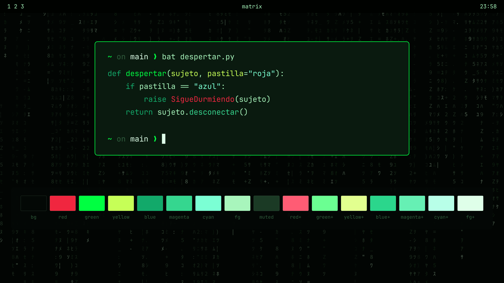

# Matrix — a pack for Omarchy 4

Phosphor green on black. A normal Omarchy theme and, on top of it, the same
digital rain on the desktop, as the screensaver, and behind the lock.



## Install

**The theme.** Colours, backgrounds and the boot mark. Depends on nothing else:

```bash
omarchy theme install https://github.com/tymurbogach/omarchy-matrix
omarchy theme set matrix
```

**The rain.** It is a shell plugin and installs separately, because an animation
does not fit inside an Omarchy theme:

```bash
~/.config/omarchy/themes/matrix/install.sh
```

That script is the only supported way in. `omarchy plugin add <this repo>` looks
like it should work — the manifest is at the root — but it installs the whole
repository as the plugin and skips the CLI, the hooks and the menu, which is
most of the pack.

The desktop rain is one more background in the carousel, `0-live-rain`.
`omarchy-matrix wallpaper on` selects it for you. Mind that `omarchy theme set`
rotates to the theme's next background, so re-applying the theme takes you off
the rain — come back with that same command, or from the menu.

## The pieces

Each one switches on and off separately, from the menu
(**SUPER → Style → Matrix**, with ✓) or from the command line:

```bash
omarchy-matrix status
omarchy-matrix wallpaper off
omarchy-matrix boot on
```

| Piece | What it is | How it is done |
|---|---|---|
| `wallpaper` | Rain on the desktop | A layer of the plugin's own at `WlrLayer.Bottom`: above the wallpaper, below every window, with `mask: Region {}` so clicks reach the desktop. **Omarchy's background is not touched.** Shows while the `0-live-rain` background is selected. On mains it always rains; on battery, only while no window is on the active workspace. |
| `screensaver` | Rain when you go idle, behaving like Omarchy's own: hides the pointer, the mouse does not dismiss it, any key does | The same layer at `WlrLayer.Overlay`, using the `idle.screensaver` timing from your `shell.json`. It sets the native `screensaver-off` flag so Omarchy does not also open its terminal screensaver. |
| `lock` | Rain behind the password field | One of the two derived pieces. See below. |
| `boot` | The screen before login, typing out the four lines from the film | The other derived piece. See below. Needs a password and rebuilds the initramfs, so it never applies on its own. |

The first three are **the same shader**, instantiated three times. That is the
whole point: the screensaver used to be `ttfx` inside a terminal — a different
program drawing a different rain — and there was no way to make all three match.

The last two are the same problem solved the same way: `lock` and `boot` are the
two pieces Omarchy gives no way to configure, and both are handled by
**deriving** its code rather than shipping a copy.

## The lock

A `WlSessionLock` is exclusive by protocol: nothing may draw inside its surface
but itself. So raining there means replacing the lock plugin, and there is no
way around that.

What is **not** done is publishing a frozen copy. That plugin carries the PAM
and fingerprint flows, and an old copy is the last one you want.
`bin/derive-lock.py` always starts from **your** Omarchy's `LockView.qml` and
applies one minimal change: it drops the blurred wallpaper and puts the rain
there. The other ~200 lines are yours. A `post-update.d` hook derives it again
after every `omarchy update`, so Omarchy's fixes keep arriving.

If the block to replace does not appear exactly once, the script **aborts and
tells you** rather than leaving things half done.

Try it without locking yourself out: `omarchy-shell lock preview`. To go back to
Omarchy's: `omarchy-matrix lock off`.

## The boot splash

Omarchy's splash is a script theme too (`omarchy.script`, `ModuleName=script`),
and what `omarchy plymouth set-by-theme` lets a theme change is three things:
background colour, text colour and **one still PNG**. No animation fits through
that door.

`bin/derive-plymouth.py` starts from your machine's `omarchy.script` and
replaces the static logo with the four lines from the start of the film, typed
out:

```
Wake up, Neo...
The Matrix has you...
Follow the white rabbit.
Knock, knock, Neo.
```

The password dialog, the progress bar and the boot messages are Omarchy's,
untouched. It installs as a **separate** theme at
`/usr/share/plymouth/themes/omarchy-matrix/`, never overwriting its own: going
back is `omarchy plymouth reset`. The `post-update.d` hook derives it again
after every `omarchy update`.

Three details that explain the design:

- **The step table is generated in Python** and reaches the `.script` with every
  text already literal, so the script needs no `SubString`, no `Length` and no
  string concatenation — code you cannot test without booting the machine.
- **The point size is worked out at derive time**, from the panel's *native*
  width. Plymouth draws at native resolution, not the logical one: a size chosen
  for 1080p comes out tiny on a 3072 px screen.
- **`logo.png` is still loaded, just invisible.** Its box is what
  `omarchy.script` uses to place the password field, and we do not want to move
  it.

> **If your disk is encrypted**, Plymouth is also what asks for your passphrase.
> That is why the patch is additive and touches none of the password callbacks.
> If anything goes wrong: `omarchy plymouth reset` from a running system, or
> `plymouth.enable=0` on the kernel line from your boot loader.

## What it touches on your system

Everything the pack installs is either its own file or a file Omarchy leaves for
extending. **Nothing** under `/usr/share/omarchy/`, nor `hyprland.lua`, nor the
background, nor the bar:

```
~/.config/omarchy/plugins/matrix.rain/     the plugin
~/.config/omarchy/matrix.json              which pieces are on
~/.config/omarchy/hooks/{theme-set,post-update}.d/matrix
~/.config/omarchy/extensions/omarchy-menu.jsonc   (block between markers)
~/.local/bin/{omarchy-matrix,derive-lock.py,derive-plymouth.py}
~/.config/omarchy/plugins/<username>.lock  only while `lock` is on
/usr/share/plymouth/themes/omarchy-matrix/ only while `boot` is on
```

The last two are the derived pieces, and neither overwrites the original:
`omarchy.lock` and Plymouth's `omarchy` theme stay where they were.

"Only while it is on" is meant literally, including for the one path outside
your home directory: `omarchy-matrix boot off` hands the splash back **and**
removes that directory. Turning a piece off leaves nothing behind, whether or
not you ever run `uninstall.sh`.

`./uninstall.sh` removes all of it, boot splash included, and leaves the theme
working like any other.

> **With "stay awake" on, the screensaver never comes up.** The pack respects
> the same switch Omarchy's idle service does
> (`~/.local/state/omarchy/indicators/stay-awake`): with it set there is no
> screensaver, neither ours nor theirs.

> **Careful with Omarchy's own toggle.** The `screensaver` piece uses the native
> `screensaver-off` flag, so `omarchy toggle screensaver` (SUPER → Toggle →
> Screensaver) turns it off underneath and `matrix.json` still says yes.
> `omarchy-matrix doctor` puts them back in agreement.

> **`omarchy refresh shell` turns the rain off.** That command rewrites
> `shell.json` wholesale, and that is where Omarchy records which plugins are
> enabled. There is no hook to attach to afterwards. Recover with
> `omarchy-matrix doctor`, or by re-applying the theme — the `theme-set` hook
> does it for you.

## Automatic

| When | What happens |
|---|---|
| `omarchy theme set matrix` | Whatever you had on comes back |
| `omarchy theme set <other>` | The pack stands down, keeping your settings |
| `omarchy update` | The lock and the boot splash are derived again from the updated sources |

Standing down means: the plugin is disabled, Omarchy's screensaver returns, and
**the lock clone is deleted** — with `omarchy plugin remove`, which is what
re-enables Omarchy's own; merely disabling it would leave you with no lock
enabled at all. Your settings are untouched: going back to matrix restores
exactly what you had.

`boot` is the exception and does not stand down: the Plymouth splash belongs to
the system, not to the theme. Its ✓ asks the system which theme is really
installed, so it never lies either.

While the pack is stood down, the menu **ticks nothing** and `omarchy-matrix
status` says why. The ✓ means "this is happening now", not "you have it
configured".

## What is inside

| | |
|---|---|
| `colors.toml` | The palette. Semantic, not `color0..15`. Includes the Hyprland border colours, which go through the template. |
| `shell.{bar,menu,launcher,notifications}.toml` | Shell section overrides: they give the bar and the cards some relief, which otherwise all paint the same black. |
| `backgrounds/` | The backgrounds, at 3840×2400. `0-live-rain` is a still frame of the shader itself: it doubles as thumbnail, as marker and as fallback. |
| `unlock.png`, `preview-unlock.png` | The static boot mark, for anyone installing the theme without the pack. With the pack, `logo.png` goes invisible and the lines are typed instead. |
| `manifest.json`, `Service.qml`, `MatrixRain.qml`, `matrix.frag.qsb`, `glyphs.png` | The plugin. |
| `bin/` | `omarchy-matrix` (the switch CLI) and the two derivers, `derive-lock.py` and `derive-plymouth.py`. |
| `hooks/`, `extensions/` | The self-repair on theme change and update, and the menu entries. |
| `rain/` | The shader sources: `matrix.frag` and the atlas generator. |
| `generate-backgrounds.py`, `generate-brand.py` | Regenerate the PNGs. Neither is an untouchable binary. |

### About the borders

The theme sets the border **colour** (`hyprland_active_border`, flat green) but
not its thickness or the rounding: `omarchy theme install` **rejects any `.lua`**
from a theme that came from git, because Lua runs code inside the compositor.
That is Omarchy's decision, not a bug. Borders keep the stock thickness.

If you want the thin frame, it belongs in your `~/.config/hypr/looknfeel.lua`:

```lua
hl.config({
  general = { border_size = 1 },
  decoration = {
    rounding = 2,
    shadow = { enabled = true, range = 14, color = "rgba(00FF4130)",
               color_inactive = "rgba(00000000)" },
  },
})
```

### The palette

Everything is green except the red, which is reserved for errors. What sets it
apart from any other green theme is that each ANSI slot sits on a **different
rung of luminance**, so in `nvim` or `bat` the syntactic roles stay apart instead
of blurring into one smear. Minimum contrast against the background: 4.86.

| | | |
|---|---|---|
| `yellow` | `#C6FF57` | lime · 17.1 |
| `cyan` | `#7BFFD4` | mint · 16.4 |
| `green` | `#00FF41` | the hero · 14.8 |
| `orange` | `#8FE03A` | · 12.4 |
| `magenta` | `#35D68F` | jade · 10.7 |
| `blue` | `#12A96A` | emerald · 6.6 |
| `red` | `#F0263F` | errors · 4.9 |

### Regenerating

```bash
./generate-backgrounds.py               # the backgrounds
./generate-backgrounds.py --out /tmp/x.png --seed 42 --density 0.7
./generate-brand.py                     # unlock, preview-unlock and preview
./rain/generate-atlas.py                # the shader's glyph atlas

# recompile the shader (qsb is not on PATH; qt6-shadertools puts it here)
/usr/lib/qt6/bin/qsb --glsl 300es,330 --hlsl 50 --msl 12 \
    -o matrix.frag.qsb rain/matrix.frag
```

Those `qsb` targets are the ones the shipped `matrix.frag.qsb` was built with —
GLSL 300 es and 330, HLSL 50, MSL 12. Using different ones silently produces a
different set of shader variants.

Needs ImageMagick, `rsvg-convert`, Python 3, the Noto Sans CJK JP font and
`qt6-shadertools` for `qsb`.

## Working on the pack

`~/.config/omarchy/themes/matrix` is what `omarchy theme install` puts there and
it gets regenerated, so editing in it loses the change. Keep a working copy
elsewhere:

```bash
git clone https://github.com/tymurbogach/omarchy-matrix ~/dev/omarchy-matrix
# edit, commit and push there, then:
cd ~/.config/omarchy/themes/matrix && git pull && ./install.sh
```

That is a detour, but it is exactly the path anyone installing the pack takes,
so mistakes surface on your machine rather than on theirs.

Editing `Service.qml` can skip the detour by copying it straight into
`~/.config/omarchy/plugins/matrix.rain/`, but **finish with `omarchy restart
shell`**: hot reloads can leave two instances alive, the old one still answering
IPC while the new one paints, and the symptom is maddening.

## Contributing

`CLAUDE.md` holds the working agreement for this repo: the rules, the two-clone
workflow, and a list of traps that each cost real debugging time. Read it before
changing anything — several of them are invisible from the code. `AGENTS.md` is a
short pointer to it, for tools that look for that name.

## Credits

The rain shader started from [`matrix.frag` in
bjarneo/quickshell](https://github.com/bjarneo/quickshell) (MIT). It swaps the
original's procedural blocks for an atlas of the real halfwidth katakana — the
very ones `ttfx matrix` uses, the effect behind Omarchy's screensaver — and
keeps its colours.

## Licence

MIT.
